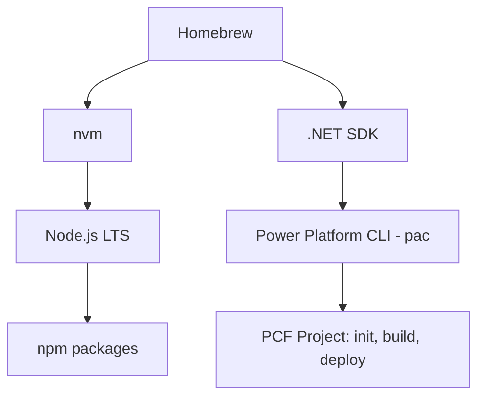

# 🚀 Guía definitiva: Entorno de desarrollo PCF en macOS

Esta guía documenta cómo preparar un Mac para crear y compilar **PCF (PowerApps Component Framework)** de Power Platform usando **Homebrew**, **nvm**, **.NET SDK** y **Power Platform CLI (pac)**.

## 📋 Requisitos previos
- macOS Ventura o superior (funciona en Intel y Apple Silicon).
- Acceso a terminal (zsh).
- Conexión a internet (obvio, pero nunca falta el despistado).

---

## 1️⃣ Instalar Homebrew
El gestor de paquetes para macOS. Si ya lo tienes, salta este paso.

```bash
/bin/bash -c "$(curl -fsSL https://raw.githubusercontent.com/Homebrew/install/HEAD/install.sh)"
```

Configurar PATH:
```bash
echo 'eval "$(/opt/homebrew/bin/brew shellenv)"' >> ~/.zprofile
eval "$(/opt/homebrew/bin/brew shellenv)"
```

Verificar:
```bash
brew --version
```

---

## 2️⃣ Instalar `nvm` (Node Version Manager)
Permite manejar múltiples versiones de Node.js, imprescindible para PCF.

```bash
brew install nvm
mkdir -p ~/.nvm
```

Configurar en zsh:
```bash
echo 'export NVM_DIR="$HOME/.nvm"' >> ~/.zshrc
echo '[ -s "$(brew --prefix nvm)/nvm.sh" ] && . "$(brew --prefix nvm)/nvm.sh"' >> ~/.zshrc
source ~/.zshrc
```

Verificar:
```bash
nvm --version
```

---

## 3️⃣ Instalar Node.js LTS
PCF funciona mejor con versiones **LTS** de Node.

```bash
nvm install --lts
nvm alias default lts/*
nvm use default
```

Verificar:
```bash
node -v
npm -v
```

---

## 4️⃣ Instalar .NET SDK
Necesario para ejecutar el **Power Platform CLI (pac)**.

```bash
brew install --cask dotnet-sdk
```

Configurar PATH para herramientas globales de .NET:
```bash
echo 'export PATH="$HOME/.dotnet/tools:$PATH"' >> ~/.zshrc
source ~/.zshrc
```

Verificar:
```bash
dotnet --version
```

---

## 5️⃣ Instalar Power Platform CLI (pac)
El CLI oficial de Microsoft, ahora distribuido como herramienta global de .NET.

```bash
dotnet tool install --global Microsoft.PowerApps.CLI.Tool
```

Verificar:
```bash
pac --version
```

---

## 6️⃣ Probar un proyecto PCF
1. Crear un control:
   ```bash
   pac pcf init --namespace Demo --name HelloControl --template field
   ```

2. Instalar dependencias:
   ```bash
   npm install
   ```

3. Compilar:
   ```bash
   npm run build
   ```

Si no explota nada, ya estás listo para trabajar con PCF en tu Mac.

---

## 🔄 Diagrama del entorno


---

## 🧹 Mantenimiento básico
- Actualizar todo:
  ```bash
  brew update && brew upgrade
  ```
- Ver qué está desactualizado:
  ```bash
  brew outdated
  ```
- Cambiar de versión de Node:
  ```bash
  nvm use 18
  nvm use 20
  ```

---

## ✅ Estado final esperado (`brew list`)
```bash
==> Formulae
nvm

==> Casks
dotnet-sdk
```

---

## 📌 Notas finales
- No uses `npm install -g pac`. Está obsoleto y genera errores con Node moderno.
- Si algún proyecto PCF no compila con Node 20, prueba Node 18 con `nvm use 18`.
- Todo se mantiene limpio con `brew` y fácil de replicar en cualquier Mac.
