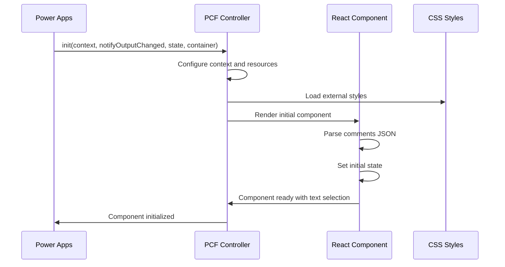
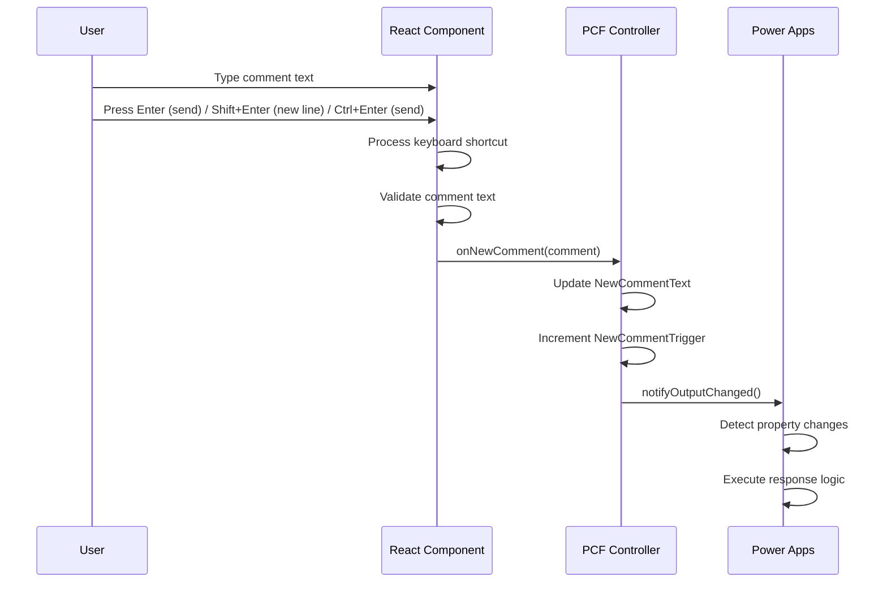
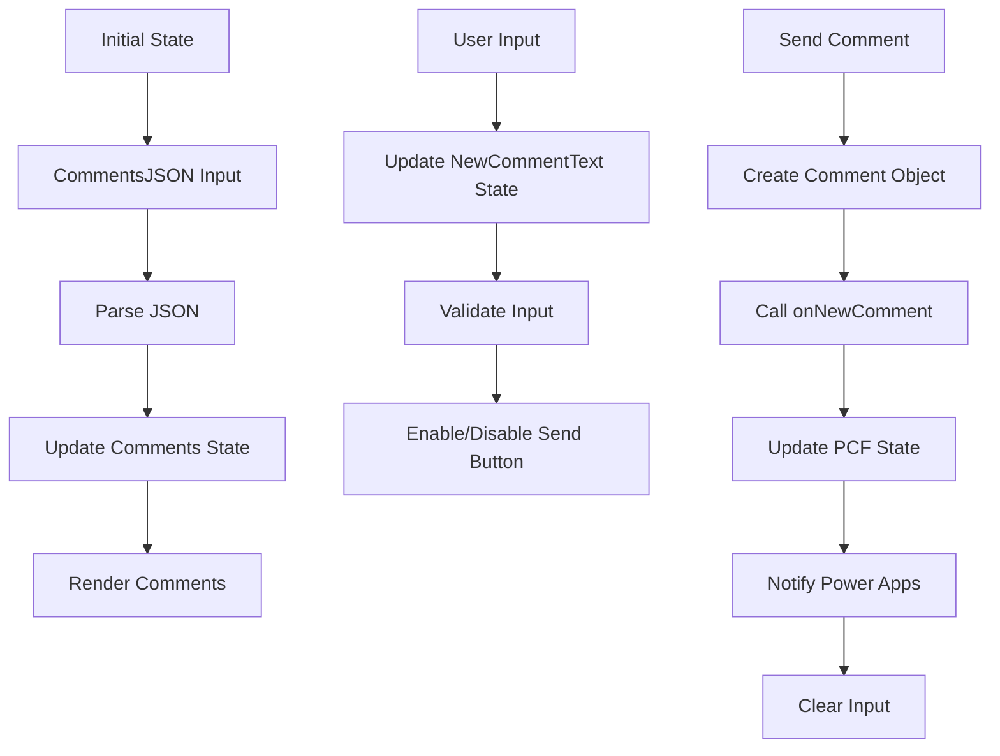

# 🏗️ Documentación Técnica - Timeline de Comentarios v2.1.2

## 📋 **Índice Técnico**
1. [Arquitectura del Sistema](#arquitectura-del-sistema)
2. [Patrones de Diseño](#patrones-de-diseño)
3. [Estructura de Código](#estructura-de-código)
4. [Flujo de Datos](#flujo-de-datos)
5. [Gestión de Estado](#gestión-de-estado)
6. [Optimización de Rendimiento](#optimización-de-rendimiento)
7. [Testing y Debugging](#testing-y-debugging)
8. [Mejores Prácticas](#mejores-prácticas)
9. [Extensibilidad](#extensibilidad)
10. [Referencias Técnicas](#referencias-técnicas)

---

## 🏗️ **Arquitectura del Sistema**

### **Arquitectura General**
```
┌─────────────────────────────────────────────────────────────────┐
│                    Power Apps Canvas                            │
├─────────────────────────────────────────────────────────────────┤
│  ┌─────────────────┐    ┌─────────────────────────────────────┐ │
│  │   Context       │    │           Outputs                   │ │
│  │   Parameters    │───▶│    NewCommentText                   │ │
│  │   Resources     │    │    NewCommentTrigger                │ │
│  │   Mode          │    │                                     │ │
│  └─────────────────┘    └─────────────────────────────────────┘ │
└─────────────────────────────────────────────────────────────────┘
                                    │
                                    ▼
┌─────────────────────────────────────────────────────────────────┐
│                PCF Control Layer                               │
│  ┌─────────────────────────────────────────────────────────────┐ │
│  │                    index.ts                                │ │
│  │  ┌─────────────────┐    ┌─────────────────────────────────┐ │ │
│  │  │   Lifecycle     │    │      State Management          │ │ │
│  │  │   Management    │◄──▶│      Output Handling           │ │ │
│  │  │   init()        │    │      notifyOutputChanged()     │ │ │
│  │  │   updateView()  │    │      getOutputs()              │ │ │
│  │  │   destroy()     │    │                                 │ │ │
│  │  └─────────────────┘    └─────────────────────────────────┘ │ │
│  └─────────────────────────────────────────────────────────────┘ │
└─────────────────────────────────────────────────────────────────┘
                                    │
                                    ▼
┌─────────────────────────────────────────────────────────────────┐
│                React Component Layer                           │
│  ┌─────────────────────────────────────────────────────────────┐ │
│  │              CommentTimeline.tsx                           │ │
│  │  ┌─────────────────┐    ┌─────────────────────────────────┐ │ │
│  │  │   UI Logic      │    │      Event Handlers            │ │ │
│  │  │   Rendering     │◄──▶│      Keyboard Shortcuts        │ │ │
│  │  │   State         │    │      Text Selection            │ │ │
│  │  │   Props         │    │      Comment Creation          │ │ │
│  │  └─────────────────┘    └─────────────────────────────────┘ │ │
│  └─────────────────────────────────────────────────────────────┘ │
└─────────────────────────────────────────────────────────────────┘
                                    │
                                    ▼
┌─────────────────────────────────────────────────────────────────┐
│                Styling Layer                                   │
│  ┌─────────────────────────────────────────────────────────────┐ │
│  │              CommentTimeline.css                           │ │
│  │  ┌─────────────────┐    ┌─────────────────────────────────┐ │ │
│  │  │   Layout        │    │      Animations                │ │ │
│  │  │   Responsive    │◄──▶│      Text Selection            │ │ │
│  │  │   Theming       │    │      Loading States            │ │ │
│  │  │   Accessibility │    │      Hover Effects             │ │ │
│  │  └─────────────────┘    └─────────────────────────────────┘ │ │
│  └─────────────────────────────────────────────────────────────┘ │
└─────────────────────────────────────────────────────────────────┘
```

### **Capas de la Arquitectura**

#### **1. Power Apps Integration Layer**
- **Responsabilidad:** Comunicación con Power Apps Canvas
- **Componentes:** Context, Parameters, Resources, Mode
- **Patrón:** Adapter Pattern

#### **2. PCF Control Layer**
- **Responsabilidad:** Gestión del ciclo de vida del componente
- **Componentes:** index.ts, lifecycle methods
- **Patrón:** Controller Pattern

#### **3. React Component Layer**
- **Responsabilidad:** Lógica de UI y gestión de estado
- **Componentes:** CommentTimeline.tsx, event handlers
- **Patrón:** Component Pattern

#### **4. Styling Layer**
- **Responsabilidad:** Presentación visual y responsive design
- **Componentes:** CommentTimeline.css, animations
- **Patrón:** Separation of Concerns

---

## 🎨 **Patrones de Diseño**

### **1. Component Pattern (React)**
```typescript
// Estructura del componente principal
export const CommentTimeline: React.FC<TimelineProps> = (props) => {
    // State management
    const [comments, setComments] = useState<SharePointComment[]>([]);
    const [newCommentText, setNewCommentText] = useState<string>("");
    
    // Event handlers
    const handleAddComment = useCallback(() => {
        // Lógica de creación de comentario
    }, [newCommentText, props.onNewComment]);
    
    const handleKeyDown = useCallback((event: React.KeyboardEvent) => {
        // Lógica de shortcuts de teclado
    }, [handleAddComment]);
    
    // Render
    return (
        <div className="comment-timeline-container">
            {/* UI Components */}
        </div>
    );
};
```

### **2. Controller Pattern (PCF)**
```typescript
export class CommentTimeline implements ComponentFramework.StandardControl<IInputs, IOutputs> {
    // Properties
    private notifyOutputChanged: () => void;
    private container: HTMLDivElement;
    private context: ComponentFramework.Context<IInputs>;
    
    // State
    private newCommentText: string = "";
    private newCommentTrigger: number = 0;
    
    // Lifecycle methods
    public init(context: ComponentFramework.Context<IInputs>, ...): void {
        // Inicialización
    }
    
    public updateView(context: ComponentFramework.Context<IInputs>): void {
        // Actualización de vista
    }
    
    public getOutputs(): IOutputs {
        // Retorno de outputs
    }
}
```

### **3. Observer Pattern (Event Handling)**
```typescript
// Event handling para nuevos comentarios
const onNewComment = (comment: any): void => {
    // Actualizar estado interno
    this.newCommentText = comment.text || "";
    this.newCommentTrigger++;
    
    // Notificar a Power Apps
    this.notifyOutputChanged();
};
```

### **4. Strategy Pattern (Keyboard Shortcuts)**
```typescript
const handleKeyDown = (event: React.KeyboardEvent) => {
    const { key, shiftKey, ctrlKey } = event;
    
    if (key === 'Enter') {
        if (shiftKey) {
            // Strategy: Nueva línea
            return; // Permitir nueva línea
        } else if (ctrlKey) {
            // Strategy: Enviar con Ctrl
            event.preventDefault();
            handleAddComment();
        } else {
            // Strategy: Enviar normal
            event.preventDefault();
            handleAddComment();
        }
    }
};
```

---

## 📁 **Estructura de Código**

### **1. Controlador PCF (index.ts)**
```typescript
import { initializeIcons } from "@fluentui/react/lib/Icons";
import * as React from "react";
import { render, unmountComponentAtNode } from "react-dom";
import { IInputs, IOutputs } from "./generated/ManifestTypes";
import { CommentTimeline as CommentTimelineComponent } from "./CommentTimeline";

// Icon registration
initializeIcons(undefined, { disableWarnings: true });

export class CommentTimeline implements ComponentFramework.StandardControl<IInputs, IOutputs> {
    // Properties
    private notifyOutputChanged: () => void;
    private container: HTMLDivElement;
    private context: ComponentFramework.Context<IInputs>;
    private resources: ComponentFramework.Resources;
    private isTestHarness: boolean;
    
    // State
    private newCommentText: string = "";
    private newCommentTrigger: number = 0;
    
    // Event handlers
    private onNewComment = (comment: any): void => {
        this.newCommentText = comment.text || "";
        this.newCommentTrigger++;
        
        console.log('Nuevo comentario creado:', comment);
        console.log('Texto de salida:', this.newCommentText);
        console.log('Trigger actualizado:', this.newCommentTrigger);
        
        this.notifyOutputChanged();
    };
    
    // Lifecycle methods
    public init(context: ComponentFramework.Context<IInputs>, ...): void {
        this.notifyOutputChanged = notifyOutputChanged;
        this.container = container;
        this.context = context;
        this.context.mode.trackContainerResize(true);
        this.resources = this.context.resources;
        this.isTestHarness = document.getElementById("control-dimensions") !== null;
    }
    
    public updateView(context: ComponentFramework.Context<IInputs>): void {
        const allocatedWidth = parseInt(context.mode.allocatedWidth as unknown as string);
        const allocatedHeight = parseInt(context.mode.allocatedHeight as unknown as string);
        const commentsJSON = context.parameters.CommentsJSON?.raw || "";
        
        render(
            React.createElement(CommentTimelineComponent, {
                width: allocatedWidth,
                height: allocatedHeight,
                commentsJSON: commentsJSON,
                resources: this.resources,
                isLoading: (this.context.parameters as any).IsLoading?.raw ?? false,
                onNewComment: this.onNewComment,
            }),
            this.container
        );
    }
    
    public getOutputs(): IOutputs {
        return {
            NewCommentText: this.newCommentText || "",
            NewCommentTrigger: this.newCommentTrigger,
        } as IOutputs;
    }
    
    public destroy(): void {
        unmountComponentAtNode(this.container);
    }
}
```

### **2. Componente React (CommentTimeline.tsx)**
```typescript
import * as React from "react";
import { Stack, Text, TextField, PrimaryButton, Spinner } from "@fluentui/react";

// Interfaces
interface SharePointComment {
    id: string;
    text: string;
    author: {
        name: string;
        email: string;
        // ... otros campos
    };
    createdDate: string;
    isReply: boolean;
    parentId: string;
    itemId: number;
    listId: string;
}

interface TimelineProps {
    width: number;
    height: number;
    commentsJSON: string;
    resources: ComponentFramework.Resources;
    isLoading?: boolean;
    onNewComment: (comment: any) => void;
}

// Componente principal
export const CommentTimeline: React.FC<TimelineProps> = (props) => {
    // State
    const [comments, setComments] = React.useState<SharePointComment[]>([]);
    const [newCommentText, setNewCommentText] = React.useState<string>("");
    
    // Effects
    React.useEffect(() => {
        if (props.commentsJSON) {
            try {
                const parsedData = JSON.parse(props.commentsJSON);
                const commentsArray = parsedData.value || [];
                setComments(commentsArray);
            } catch (error) {
                console.error('Error parsing comments JSON:', error);
                setComments([]);
            }
        }
    }, [props.commentsJSON]);
    
    // Event handlers
    const handleAddComment = React.useCallback(() => {
        if (newCommentText.trim()) {
            const newComment = {
                id: `temp-${Date.now()}`,
                text: newCommentText.trim(),
                author: {
                    name: "Usuario Actual",
                    email: "usuario@ejemplo.com"
                },
                createdDate: new Date().toISOString(),
                isReply: false,
                parentId: "",
                itemId: 0,
                listId: ""
            };
            
            props.onNewComment(newComment);
            setNewCommentText("");
        }
    }, [newCommentText, props.onNewComment]);
    
    const handleKeyDown = React.useCallback((event: React.KeyboardEvent) => {
        if (event.key === 'Enter') {
            if (event.shiftKey) {
                // Permitir nueva línea
                return;
            } else if (event.ctrlKey) {
                // Enviar con Ctrl+Enter
                event.preventDefault();
                handleAddComment();
            } else {
                // Enviar con Enter
                event.preventDefault();
                handleAddComment();
            }
        }
    }, [handleAddComment]);
    
    // Loading state
    if (props.isLoading) {
        return (
            <div className="comment-timeline-container">
                <div className="loading-container">
                    <Spinner label="Cargando comentarios..." />
                    <div className="loading-skeleton">
                        {[1, 2, 3].map(i => (
                            <div key={i} className="skeleton-loader skeleton-header" />
                        ))}
                    </div>
                </div>
            </div>
        );
    }
    
    // Render
    return (
        <div className="comment-timeline-container">
            {/* Header */}
            <div className="comment-timeline-header">
                <h2 className="comment-timeline-title">
                    {props.resources.getString("CommentTimeline")}
                </h2>
            </div>
            
            {/* Content */}
            <div className="comment-timeline-content">
                {comments.map((comment) => (
                    <div key={comment.id} className="comment-item">
                        <div className="comment-header">
                            <span className="comment-author comment-text-selectable">
                                {comment.author.name}
                            </span>
                            <span className="comment-date comment-text-selectable">
                                {formatDate(comment.createdDate)}
                            </span>
                        </div>
                        <p className="comment-text comment-text-selectable">
                            {comment.text}
                        </p>
                    </div>
                ))}
            </div>
            
            {/* Input Area */}
            <div className="comment-input-area">
                <div className="comment-input-container">
                    <div className="comment-text-field">
                        <TextField
                            multiline
                            rows={3}
                            value={newCommentText}
                            onChange={(_, newValue) => setNewCommentText(newValue || "")}
                            onKeyDown={handleKeyDown}
                            placeholder="Escribe un comentario... (Enter: enviar, Shift+Enter: nueva línea)"
                        />
                        <div className="shortcut-indicator">
                            Enter: enviar | Shift+Enter: nueva línea
                        </div>
                    </div>
                    <PrimaryButton
                        className="comment-send-button"
                        onClick={handleAddComment}
                        disabled={!newCommentText.trim()}
                    >
                        Enviar
                    </PrimaryButton>
                </div>
            </div>
        </div>
    );
};

// Utility functions
const formatDate = (dateString: string): string => {
    const date = new Date(dateString);
    const now = new Date();
    const diffInHours = (now.getTime() - date.getTime()) / (1000 * 60 * 60);
    
    if (diffInHours < 1) {
        return "Hace menos de 1 hora";
    } else if (diffInHours < 24) {
        return `Hace ${Math.floor(diffInHours)} horas`;
    } else {
        return date.toLocaleDateString('es-ES', {
            year: 'numeric',
            month: 'short',
            day: 'numeric',
            hour: '2-digit',
            minute: '2-digit'
        });
    }
};
```

### **3. Estilos CSS (CommentTimeline.css)**
```css
/* Estilos para el componente CommentTimeline */

/* Contenedor principal */
.comment-timeline-container {
    font-family: 'Segoe UI', Tahoma, Geneva, Verdana, sans-serif;
    height: 100%;
    display: flex;
    flex-direction: column;
    background: transparent;
}

/* Header */
.comment-timeline-header {
    display: flex;
    justify-content: space-between;
    align-items: center;
    padding: 12px 16px;
    background: transparent;
    border-bottom: 1px solid #e1e1e1;
    margin-bottom: 16px;
}

.comment-timeline-title {
    font-size: 18px;
    font-weight: 600;
    color: #323130;
    margin: 0;
}

/* Área de comentarios */
.comment-timeline-content {
    flex: 1;
    overflow-y: auto;
    padding: 0 16px;
    background: transparent;
}

/* Comentario individual */
.comment-item {
    margin-bottom: 16px;
    padding: 12px;
    border-radius: 8px;
    background: #f8f9fa;
    border: 1px solid #e1e1e1;
    transition: all 0.2s ease;
}

.comment-item:hover {
    box-shadow: 0 2px 8px rgba(0, 0, 0, 0.1);
    transform: translateY(-1px);
}

/* Encabezado del comentario */
.comment-header {
    display: flex;
    align-items: center;
    margin-bottom: 8px;
}

.comment-author {
    font-weight: 600;
    color: #323130;
    margin-right: 8px;
    user-select: text;
    cursor: text;
}

.comment-date {
    font-size: 12px;
    color: #605e5c;
    user-select: text;
    cursor: text;
}

/* Contenido del comentario */
.comment-text {
    color: #323130;
    line-height: 1.5;
    margin: 0;
    user-select: text;
    cursor: text;
}

/* Área de nuevo comentario */
.comment-input-area {
    padding: 16px;
    border-top: 1px solid #e1e1e1;
    background: transparent;
}

.comment-input-container {
    display: flex;
    gap: 8px;
    align-items: flex-end;
}

.comment-text-field {
    flex: 1;
    position: relative;
}

.comment-send-button {
    min-width: 80px;
}

/* Estilos para texto seleccionable */
.comment-text-selectable {
    user-select: text;
    cursor: text;
    transition: background-color 0.2s ease;
}

.comment-text-selectable:hover {
    background-color: rgba(0, 120, 212, 0.1);
}

/* Indicador de shortcuts */
.shortcut-indicator {
    position: absolute;
    right: 8px;
    top: 50%;
    transform: translateY(-50%);
    font-size: 10px;
    color: #605e5c;
    background: rgba(255, 255, 255, 0.9);
    padding: 2px 6px;
    border-radius: 4px;
    opacity: 0;
    transition: opacity 0.2s ease;
    pointer-events: none;
}

.comment-text-field:focus-within .shortcut-indicator {
    opacity: 1;
}

/* Animaciones de carga */
@keyframes pulse {
    0%, 100% { opacity: 1; }
    50% { opacity: 0.5; }
}

@keyframes shimmer {
    0% { background-position: -200px 0; }
    100% { background-position: calc(200px + 100%) 0; }
}

@keyframes fadeInUp {
    from {
        opacity: 0;
        transform: translateY(20px);
    }
    to {
        opacity: 1;
        transform: translateY(0);
    }
}

/* Skeleton loaders */
.skeleton-loader {
    background: linear-gradient(90deg, #f0f0f0 25%, #e0e0e0 50%, #f0f0f0 75%);
    background-size: 200px 100%;
    animation: shimmer 1.5s infinite;
    border-radius: 4px;
}

.skeleton-header {
    height: 24px;
    width: 60%;
    margin-bottom: 8px;
}

.skeleton-text {
    height: 16px;
    width: 100%;
    margin-bottom: 4px;
}

.skeleton-text-short {
    height: 16px;
    width: 80%;
}

/* Estados de carga */
.loading-container {
    padding: 20px;
    text-align: center;
}

.loading-skeleton {
    animation: fadeInUp 0.6s ease-out;
}

/* Responsive */
@media (max-width: 768px) {
    .comment-timeline-header {
        padding: 8px 12px;
    }
    
    .comment-timeline-content {
        padding: 0 12px;
    }
    
    .comment-input-area {
        padding: 12px;
    }
}
```

---

## 🔄 **Flujo de Datos**

### **1. Inicialización del Componente**


### **2. Creación de Nuevo Comentario**


### **3. Actualización de Vista**
```mermaid
flowchart TD
    A[Power Apps Context Update] --> B[PCF updateView()]
    B --> C[Parse CommentsJSON]
    C --> D[Update React State]
    D --> E[Re-render Component]
    E --> F[Apply CSS Styles]
    F --> G[Display Updated UI]
```

---

## 🎯 **Gestión de Estado**

### **1. Estado del Controlador PCF**
```typescript
// Estado interno del controlador
export class CommentTimeline {
    // Properties
    private notifyOutputChanged: () => void;
    private container: HTMLDivElement;
    private context: ComponentFramework.Context<IInputs>;
    private resources: ComponentFramework.Resources;
    private isTestHarness: boolean;
    
    // State variables
    private newCommentText: string = "";
    private newCommentTrigger: number = 0;
}
```

### **2. Estado del Componente React**
```typescript
// Estado del componente React
export const CommentTimeline: React.FC<TimelineProps> = (props) => {
    // Local state
    const [comments, setComments] = React.useState<SharePointComment[]>([]);
    const [newCommentText, setNewCommentText] = React.useState<string>("");
    
    // Derived state
    const hasComments = comments.length > 0;
    const canSendComment = newCommentText.trim().length > 0;
};
```

### **3. Flujo de Estado**


---

## ⚡ **Optimización de Rendimiento**

### **1. React Optimizations**
```typescript
// Memoización de callbacks
const handleAddComment = React.useCallback(() => {
    // Lógica de creación de comentario
}, [newCommentText, props.onNewComment]);

const handleKeyDown = React.useCallback((event: React.KeyboardEvent) => {
    // Lógica de shortcuts
}, [handleAddComment]);

// Memoización de componentes
const CommentItem = React.memo<{comment: SharePointComment}>(({comment}) => {
    return (
        <div className="comment-item">
            {/* Render comment */}
        </div>
    );
});
```

### **2. CSS Optimizations**
```css
/* Optimizaciones de CSS */
.comment-item {
    /* Usar transform en lugar de position para animaciones */
    transform: translateY(0);
    transition: transform 0.2s ease;
}

.comment-item:hover {
    transform: translateY(-1px);
}

/* Usar will-change para animaciones */
.skeleton-loader {
    will-change: background-position;
    animation: shimmer 1.5s infinite;
}
```

### **3. Bundle Optimization**
```json
// package.json optimizations
{
  "scripts": {
    "build": "pcf-scripts build",
    "build:production": "pcf-scripts build --buildMode production"
  }
}
```

---

## 🧪 **Testing y Debugging**

### **1. Test Harness**
```bash
# Iniciar test harness
npm start

# Modo watch para desarrollo
npm run start:watch
```

### **2. Debugging en Power Apps**
```typescript
// Logs para debugging
console.log('Nuevo comentario creado:', comment);
console.log('Texto de salida:', this.newCommentText);
console.log('Trigger actualizado:', this.newCommentTrigger);
console.log('Shortcut procesado:', event.key);
```

### **3. CSS Debugging**
```css
/* Debug styles */
.debug-border {
    border: 1px solid red !important;
}

.debug-background {
    background-color: rgba(255, 0, 0, 0.1) !important;
}
```

### **4. Performance Monitoring**
```typescript
// Performance monitoring
const startTime = performance.now();
// ... código a medir
const endTime = performance.now();
console.log(`Tiempo de ejecución: ${endTime - startTime}ms`);
```

---

## 📋 **Mejores Prácticas**

### **1. Código Limpio**
```typescript
// ✅ Bueno: Nombres descriptivos
const handleNewCommentCreation = () => {
    const commentText = newCommentText.trim();
    if (commentText) {
        createComment(commentText);
    }
};

// ❌ Malo: Nombres poco descriptivos
const handle = () => {
    const text = newCommentText.trim();
    if (text) {
        create(text);
    }
};
```

### **2. Manejo de Errores**
```typescript
// Manejo robusto de errores
const parseComments = (jsonString: string): SharePointComment[] => {
    try {
        const parsedData = JSON.parse(jsonString);
        return parsedData.value || [];
    } catch (error) {
        console.error('Error parsing comments JSON:', error);
        return [];
    }
};
```

### **3. TypeScript Best Practices**
```typescript
// Interfaces bien definidas
interface TimelineProps {
    width: number;
    height: number;
    commentsJSON: string;
    resources: ComponentFramework.Resources;
    isLoading?: boolean;
    onNewComment: (comment: SharePointComment) => void;
}

// Tipos específicos
type CommentId = string;
type UserEmail = string;
```

### **4. CSS Best Practices**
```css
/* Usar variables CSS */
:root {
    --primary-color: #0078d4;
    --border-color: #e1e1e1;
    --text-color: #323130;
}

/* Usar clases semánticas */
.comment-timeline-container {
    /* Estilos del contenedor */
}

.comment-item {
    /* Estilos del item */
}
```

---

## 🔧 **Extensibilidad**

### **1. Agregar Nuevas Funcionalidades**
```typescript
// Extensión: Sistema de likes
interface ExtendedComment extends SharePointComment {
    likes: number;
    isLiked: boolean;
}

const handleLike = (commentId: string) => {
    // Lógica de like
};
```

### **2. Temas Personalizables**
```css
/* Sistema de temas */
.theme-light {
    --background-color: #ffffff;
    --text-color: #323130;
}

.theme-dark {
    --background-color: #1f1f1f;
    --text-color: #ffffff;
}
```

### **3. Configuración Dinámica**
```typescript
// Configuración flexible
interface TimelineConfig {
    showAvatars: boolean;
    maxComments: number;
    dateFormat: 'relative' | 'absolute';
    enableReplies: boolean;
}
```

---

## 📚 **Referencias Técnicas**

### **Documentación Oficial**
- [Power Apps Component Framework](https://docs.microsoft.com/en-us/powerapps/developer/component-framework/overview)
- [PCF Manifest Schema](https://docs.microsoft.com/en-us/powerapps/developer/component-framework/manifest-schema-reference)
- [Fluent UI React](https://developer.microsoft.com/en-us/fluentui#/controls/web)
- [React Documentation](https://reactjs.org/docs/getting-started.html)
- [TypeScript Handbook](https://www.typescriptlang.org/docs/)

### **Patrones de Diseño**
- [Component Pattern](https://reactjs.org/docs/components-and-props.html)
- [Observer Pattern](https://en.wikipedia.org/wiki/Observer_pattern)
- [Strategy Pattern](https://en.wikipedia.org/wiki/Strategy_pattern)
- [Adapter Pattern](https://en.wikipedia.org/wiki/Adapter_pattern)

### **Mejores Prácticas**
- [React Best Practices](https://reactjs.org/docs/hooks-faq.html)
- [TypeScript Best Practices](https://www.typescriptlang.org/docs/handbook/declaration-files/do-s-and-don-ts.html)
- [CSS Best Practices](https://developer.mozilla.org/en-US/docs/Learn/CSS/Building_blocks/Organizing)
- [Performance Best Practices](https://web.dev/performance/)

---

## 🎉 **Conclusión Técnica**

El **Timeline de Comentarios v2.0.0** implementa una arquitectura sólida y escalable que sigue las mejores prácticas de desarrollo moderno. Con su separación clara de responsabilidades, patrones de diseño bien implementados y optimizaciones de rendimiento, el componente está preparado para entornos de producción exigentes.

**Aspectos técnicos destacados:**
- ✅ **Arquitectura modular** con separación clara de capas
- ✅ **Patrones de diseño** bien implementados
- ✅ **Optimizaciones de rendimiento** en React y CSS
- ✅ **Manejo robusto de errores** y edge cases
- ✅ **Código TypeScript** tipado y mantenible
- ✅ **CSS externalizado** y organizado
- ✅ **Sistema de eventos** eficiente
- ✅ **Extensibilidad** para futuras funcionalidades

**El componente está técnicamente preparado para escalar y evolucionar según las necesidades del proyecto.**

---

*Documentación técnica generada automáticamente - Versión 2.0.0*
*Última actualización: $(Get-Date)*
*Rama: master*
