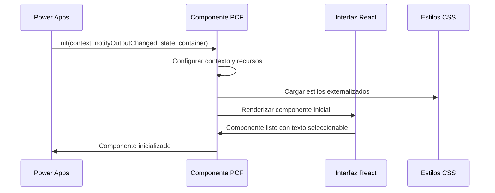
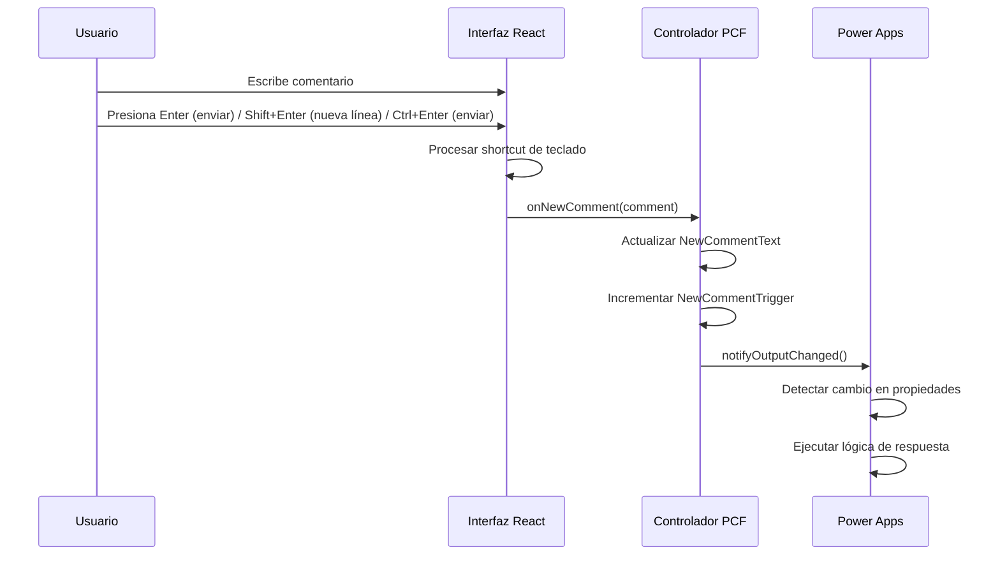
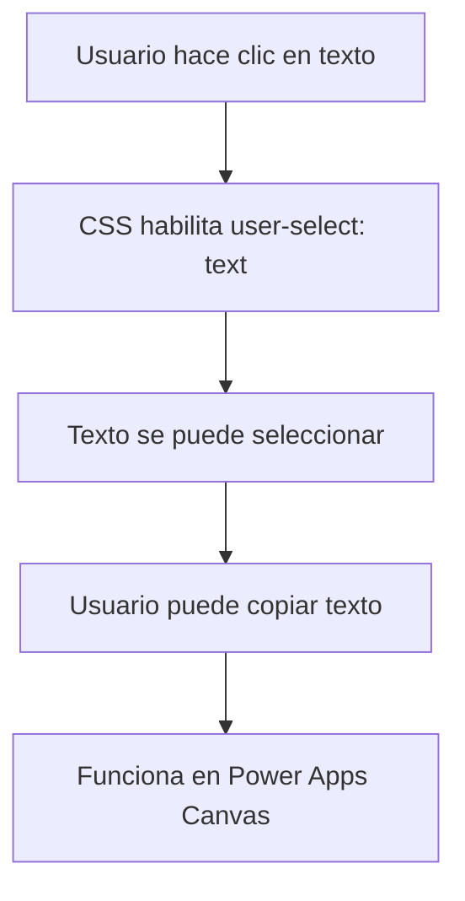
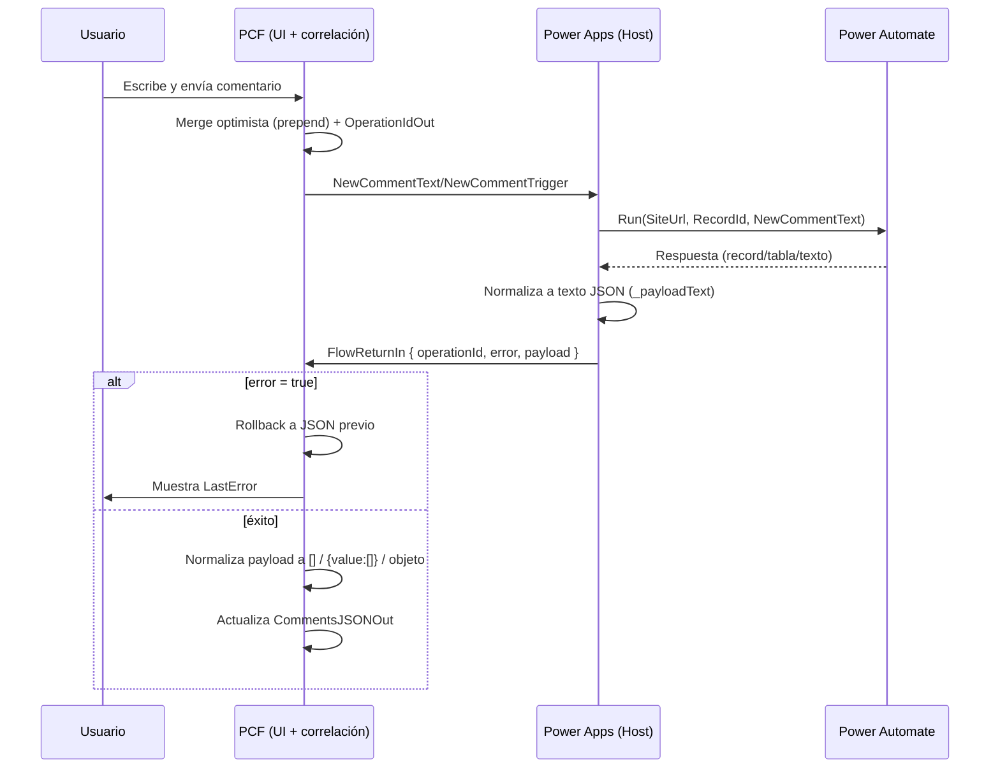
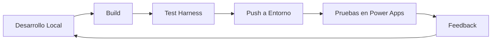

# 📚 Timeline de Comentarios - Documentación Técnica Completa v2.1.1

## 📋 **Índice**
1. [Descripción General](#descripción-general)
2. [Arquitectura del Sistema](#arquitectura-del-sistema)
3. [Estructura del Proyecto](#estructura-del-proyecto)
4. [Configuración Técnica](#configuración-técnica)
5. [Propiedades del Componente](#propiedades-del-componente)
6. [Flujo de Datos](#flujo-de-datos)
7. [Guía de Despliegue](#guía-de-despliegue)
8. [Integración con Power Apps](#integración-con-power-apps)
9. [Troubleshooting](#troubleshooting)
10. [Referencias Técnicas](#referencias-técnicas)
11. [Control de Versiones](#control-de-versiones)

---

## 🎯 **Descripción General**

### **¿Qué es este componente?**
El **Timeline de Comentarios** es un componente PCF (Power Apps Component Framework) diseñado para mostrar y gestionar comentarios de SharePoint en Power Apps Canvas. Proporciona una interfaz moderna, responsiva y accesible para la visualización y creación de comentarios.

### **Características Principales v2.1.1**
- ✅ **Avatares inteligentes** - Fotos reales de SharePoint con fallback a iniciales
- ✅ **Host del tenant** - Configuración automática para máxima compatibilidad
- ✅ **Texto seleccionable** - Los usuarios pueden copiar texto de comentarios
- ✅ **Shortcuts de teclado** - Enter para enviar comentarios
- ✅ **Contador de caracteres** - Límite de 2000 caracteres con indicadores visuales
- ✅ **Auto-resize vertical** - El campo de texto se ajusta automáticamente al contenido
- ✅ **Control de expansión** - Evita que el campo se salga del componente PCF
- ✅ **Sistema de eventos** para notificaciones y flows
- ✅ **Integración nativa** con Power Apps Canvas
- ✅ **Diseño moderno** con Fluent UI
- ✅ **CSS organizado** en archivo separado
- ✅ **Animaciones de carga** con skeleton loaders
- ✅ **Responsive design** para diferentes dispositivos

### **Novedades en v2.1.1**
- 🆕 **Avatares de SharePoint** - Fotos reales usando `userphoto.aspx`
- 🆕 **Fallback inteligente** - Iniciales con colores personalizados
- 🆕 **Host del tenant** - Configuración automática para evitar errores 401/403
- 🆕 **Dimensiones perfectas** - Avatares 40x40px sin descuadres
- 🆕 **Selección de texto** habilitada en Power Apps Canvas
- 🆕 **Keyboard shortcuts** para mejor UX
- 🆕 **Indicador visual** de shortcuts
- 🆕 **CSS externalizado** para mejor mantenimiento
- 🆕 **Propiedades optimizadas** (eliminadas propiedades obsoletas)

---

## 🏗️ **Arquitectura del Sistema**

### **Diagrama de Arquitectura v2.0.0**
```
┌─────────────────────────────────────────────────────────────┐
│                    Power Apps Canvas                        │
├─────────────────────────────────────────────────────────────┤
│  ┌─────────────────┐    ┌─────────────────────────────────┐ │
│  │   Entrada       │    │           Salida                │ │
│  │   CommentsJSON  │───▶│    NewCommentText               │ │
│  │   IsLoading     │    │    NewCommentTrigger            │ │
│  └─────────────────┘    └─────────────────────────────────┘ │
└─────────────────────────────────────────────────────────────┘
                              │
                              ▼
┌─────────────────────────────────────────────────────────────┐
│                Componente PCF v2.0.0                      │
│  ┌─────────────────┐    ┌─────────────────────────────────┐ │
│  │   index.ts      │    │      CommentTimeline.tsx        │ │
│  │   (Controlador) │◄──▶│      (Interfaz React)          │ │
│  └─────────────────┘    └─────────────────────────────────┘ │
│                              │                              │
│  ┌─────────────────────────────────────────────────────────┐ │
│  │              CommentTimeline.css                        │ │
│  │           (Estilos externalizados)                      │ │
│  └─────────────────────────────────────────────────────────┘ │
└─────────────────────────────────────────────────────────────┘
                              │
                              ▼
┌─────────────────────────────────────────────────────────────┐
│                    SharePoint                               │
│              (Fuente de datos)                             │
└─────────────────────────────────────────────────────────────┘
```

### **Componentes del Sistema v2.0.0**
1. **Controlador PCF** (`index.ts`) - Maneja la lógica de negocio y propiedades
2. **Interfaz React** (`CommentTimeline.tsx`) - Renderiza la UI con nuevas funcionalidades
3. **Estilos CSS** (`CommentTimeline.css`) - Estilos externalizados y organizados
4. **Manifest** (`ControlManifest.Input.xml`) - Define las propiedades actualizadas
5. **Recursos** (`*.resx`) - Maneja la localización

---

## 📁 **Estructura del Proyecto v2.0.0**

```
CanvasGridControl/
├── 📁 CanvasGrid/                    # Componente principal
│   ├── 📄 index.ts                   # Controlador PCF (actualizado)
│   ├── 📄 CommentTimeline.tsx        # Componente React (nuevas funcionalidades)
│   ├── 📄 ControlManifest.Input.xml  # Configuración v2.0.0
│   ├── 📁 css/                       # Estilos externalizados
│   │   └── 📄 CommentTimeline.css    # CSS organizado
│   ├── 📁 generated/                 # Tipos generados automáticamente
│   │   └── 📄 ManifestTypes.d.ts     # Interfaces TypeScript
│   └── 📁 strings/                   # Recursos de localización
│       └── 📄 CommentTimeline.1033.resx
├── 📁 Solution/                      # Solución de Dataverse
│   └── 📁 PCF_SMA/                   # Proyecto de solución
│       ├── 📄 PCF_SMA.cdsproj        # Archivo de proyecto
│       └── 📄 bin/Debug/PCF_SMA.zip  # Solución empaquetada
├── 📄 package.json                   # Dependencias del proyecto
├── 📄 tsconfig.json                  # Configuración TypeScript
├── 📄 CanvasGrid.pcfproj             # Proyecto PCF
├── 📄 INSTRUCCIONES-DE-USO.md       # Esta documentación
└── 📄 GIT-PARA-PRINCIPIANTES.md     # Guía de Git
```

---

## ⚙️ **Configuración Técnica**

### **Dependencias Principales**
```json
{
  "@fluentui/react": "^8.121.3",        // UI Framework de Microsoft
  "react": "^16.14.0",                  // Biblioteca de UI
  "react-dom": "^16.14.0",              // Renderizado DOM
  "typescript": "^4.9.5"                // Compilador TypeScript
}
```

### **Configuración TypeScript**
```json
{
  "compilerOptions": {
    "target": "ES6",                     // Versión de JavaScript
    "lib": ["ES6", "DOM"],              // Librerías incluidas
    "jsx": "react",                     // Soporte JSX
    "moduleResolution": "node"           // Resolución de módulos
  }
}
```

### **Configuración PCF v2.0.0**
```xml
<control 
  namespace="YBComments"                # Espacio de nombres único
  constructor="CommentTimeline"          # Clase del componente
  version="2.0.0"                       # Versión actualizada
  control-type="standard"               # Tipo de control
>
  <resources>
    <code path="index.ts" order="1" />
    <resx path="strings/CommentTimeline.1033.resx" version="1.0.0" />
    <css path="css/CommentTimeline.css" order="1" />  <!-- CSS externalizado -->
  </resources>
</control>
```

---

## 🔧 **Propiedades del Componente v2.0.0**

### **🔽 Propiedades de Entrada (Input Properties)**

| Propiedad | Tipo | Requerido | Descripción |
|-----------|------|-----------|-------------|
| `CommentsJSON` | Multiple | ❌ | JSON de comentarios de SharePoint |
| `IsLoading` | TwoOptions | ❌ | Indica si el componente está cargando datos |

### **🔼 Propiedades de Salida (Output Properties)**

| Propiedad | Tipo | Requerido | Descripción |
|-----------|------|-----------|-------------|
| `NewCommentText` | SingleLine.TextArea | ✅ | Texto del nuevo comentario |
| `NewCommentTrigger` | Whole.None | ✅ | Trigger para detectar nuevos comentarios (incrementa cada vez) |

### **❌ Propiedades Eliminadas en v2.0.0**
- `ShowReplies` - Eliminada para simplificar
- `CurrentUserName` - Eliminada (se maneja internamente)
- `CurrentUserEmail` - Eliminada (se maneja internamente)
- `CommentCount` - Eliminada (no necesaria)

### **📊 Estructura de Datos Esperada**

```typescript
interface SharePointComment {
    id: string;                          // Identificador único
    text: string;                        // Contenido del comentario
    author: {                            // Información del autor
        name: string;                    // Nombre completo
        email: string;                   // Email del usuario
        directoryObjectId?: string;      // ID de directorio
        id: number;                      // ID numérico
        isActive: boolean;               // Estado activo
        isExternal: boolean;             // Usuario externo
        jobTitle?: string;               // Cargo del usuario
        loginName: string;               // Nombre de login
        principalType: number;           // Tipo de principal
        userId?: string;                 // ID de usuario
        userPrincipalName?: string;      // UPN del usuario
    };
    createdDate: string;                 // Fecha de creación (ISO)
    modifiedDate?: string;               // Fecha de modificación
    isReply: boolean;                    // Es una respuesta
    parentId: string;                    // ID del comentario padre
    itemId: number;                      // ID del item de SharePoint
    listId: string;                      // ID de la lista
}
```

---

## 🔄 **Flujo de Datos v2.0.0**

### **1. Inicialización del Componente**


### **2. Creación de Nuevo Comentario con Shortcuts**


### **3. Flujo de Selección de Texto**


---

## 🚀 **Guía de Despliegue v2.0.0**

### **Requisitos Previos**
- ✅ **Node.js** 16.x o superior
- ✅ **Power Platform CLI** (pac) instalado
- ✅ **Acceso** a entorno de Power Apps
- ✅ **Permisos** de desarrollador en el entorno
- ✅ **Git** para control de versiones

### **Comandos de Despliegue**

#### **Opción 1: Despliegue Directo (Recomendado)**
```bash
# 1. Verificar rama actual
git branch

# 2. Seleccionar entorno
pac org select --environment "https://tuentorno.crm.dynamics.com"

# 3. Build del componente
npm run build

# 4. Push al entorno
pac pcf push --publisher-prefix yb
```

#### **Opción 2: Crear Solución ZIP**
```bash
# 1. Build del componente
npm run build

# 2. Generar solución ZIP
cd Solution/PCF_SMA
dotnet build

# 3. La solución ZIP se crea en: bin/Debug/PCF_SMA.zip
```

### **Verificación del Despliegue v2.0.0**
- ✅ **Componente visible** en Power Apps Canvas
- ✅ **Propiedades de entrada** configuradas
- ✅ **Propiedades de salida** disponibles
- ✅ **Texto seleccionable** funciona
- ✅ **Shortcuts de teclado** operativos
- ✅ **Indicador visual** de shortcuts visible

---

## 🔌 **Integración con Power Apps v2.0.0**

### **Configuración en Canvas App**

#### **1. Agregar el Componente**
```
1. Insertar → Componentes personalizados
2. Buscar: "yb_YBComments.CommentTimeline"
3. Arrastrar al canvas
4. Configurar propiedades de entrada
```

#### **2. Configurar Propiedades de Entrada**
```powerapps
// En la propiedad CommentsJSON
Set(
  CommentsTimeline.CommentsJSON,
    JSON(SharePointList.value)
)

// En IsLoading (opcional)
false  // o true si está cargando datos
```

#### **3. Capturar Propiedades de Salida**
```powerapps
// Variable para el último trigger
Set(varLastTrigger, 0);

// Detectar nuevo comentario
If(
    CommentsTimeline.NewCommentTrigger > varLastTrigger,
    // Hay nuevo comentario
    Set(varNuevoComentario, CommentsTimeline.NewCommentText);
    Set(varLastTrigger, CommentsTimeline.NewCommentTrigger);
    
    // Mostrar notificación
    Notify(
        "Nuevo comentario: " & CommentsTimeline.NewCommentText,
        NotificationType.Success
    );
    
    // Enviar a SharePoint o procesar
    Patch(
        SharePointList,
        Defaults(SharePointList),
        {
            Title: varNuevoComentario,
            Author: User().FullName,
            Created: Now()
        }
    )
)
```

### **Nuevas Funcionalidades en Power Apps**

#### **Texto Seleccionable**
- ✅ **Los usuarios pueden copiar** texto de comentarios
- ✅ **Funciona en Power Apps Canvas** (no solo en test harness)
- ✅ **Selección visual** con hover effects

#### **Shortcuts de Teclado**
- ✅ **Enter** - Enviar comentario
- ✅ **Shift+Enter** - Nueva línea en el texto
- ✅ **Ctrl+Enter** - Enviar comentario (alternativo)
- ✅ **Indicador visual** muestra los shortcuts disponibles

### **Integración con Power Automate**

#### **Flujo de Notificación Mejorado**
```yaml
Trigger: When CommentsTimeline.NewCommentTrigger changes
Actions:
  1. Get NewCommentText value
  2. Create item in SharePoint
  3. Send email notification with comment text
  4. Update trigger value
  5. Log activity for audit
```

---

## 🔁 Integración Simplificada con Flow (FlowReturnIn)

> A partir de v2.1.x, el componente soporta un contrato simplificado para publicar comentarios con UI optimista, rollback y normalización. La app host solo ejecuta el Flow y retorna un JSON autocontenido.

### 1) Propiedades relevantes

- `SiteUrl` (input): URL del sitio SharePoint
- `RecordId` (input): Identificador del registro
- `FlowReturnIn` (input): JSON autocontenido devuelto por la app tras ejecutar el Flow
- `OperationIdOut` (output): GUID de correlación emitido por el componente al iniciar la operación
- `NewCommentText` / `NewCommentTrigger` (outputs): Señal de que hay un nuevo comentario a publicar (texto y trigger)

### 2) Formato de `FlowReturnIn`

```json
{
  "operationId": "<GUID>",
  "error": false,
  "payload": "<texto JSON devuelto por el Flow>"
}
```

- `operationId`: Debe ser exactamente el valor de `OperationIdOut` emitido por el PCF.
- `error`: `true` si el Flow falló; el componente hace rollback automático.
- `payload`: Texto JSON del resultado del Flow. Puede ser `[]`, `{}` o `{ "value": [...] }`.

El PCF se encarga de la correlación, rollback y normalización de `payload` a `[]`.

### 3) Wiring mínimo en Power Apps

1. Variables (por ejemplo en `OnVisible` del Screen):

```powerfx
Set(varFlowReturn, "");
Set(varLastTrigger, -1);
```

2. Enlaces del PCF:

```text
CommentTimelinePCF.SiteUrl = <tu URL de sitio>
CommentTimelinePCF.RecordId = <tu ID de registro>
CommentTimelinePCF.CommentsJSON = <tu JSON de comentarios>
CommentTimelinePCF.FlowReturnIn = varFlowReturn
```

3. Ejecutar el Flow cuando hay nuevo comentario (vigilar trigger):

```powerfx
If(
    CommentTimelinePCF.NewCommentTrigger > varLastTrigger,
    Set(varLastTrigger, CommentTimelinePCF.NewCommentTrigger);

    // Limpiar retorno previo
    Set(varFlowReturn, "");

    // Ejecutar Flow con manejo de errores
    Set(_hadError, false);
    Set(
        _resp,
        IfError(
            CrearcomentariosSMA.Run(
                CommentTimelinePCF.SiteUrl,
                CommentTimelinePCF.RecordId,
                CommentTimelinePCF.NewCommentText
            ),
            Set(_hadError, true);
            Blank()
        )
    );

    // Normalizar payload del Flow a texto JSON
    Set(
        _payloadText,
        If(
            _hadError || IsBlank(_resp),
            "",
            If(
                IsType(_resp, Table) || IsType(_resp, Record),
                JSON(_resp, JSONFormat.Compact),
                IsBlank(_resp.response) && IsBlank(_resp.value),
                Text(_resp),
                JSON(Coalesce(_resp.response, _resp.value), JSONFormat.Compact)
            )
        )
    );

    // Devolver paquete autocontenido al PCF
    Set(
        varFlowReturn,
        JSON(
            {
                operationId: CommentTimelinePCF.OperationIdOut,
                error: _hadError || IsBlank(_payloadText),
                payload: _payloadText
            },
            JSONFormat.Compact
        )
    )
);
```

### 4) Notas y buenas prácticas

- No necesitas manejar contadores de versión ni eco de operación desde la app.
- El límite de texto es de **2000 caracteres**; el botón se deshabilita si se excede.
- El componente realiza merge optimista, y si `error = true` realiza rollback automático.
- `payload` admite `[]`, objeto único o `{ value: [...] }`; el componente lo normaliza a array.
- Limpia `varFlowReturn` antes de cada ejecución para evitar reprocesado.

### 5) Diagrama del flujo optimista y rollback



---

## 🐛 **Troubleshooting v2.0.0**

### **Problemas Comunes**

#### **1. Propiedades de Salida No Visibles**
**Síntoma:** Las propiedades `NewCommentText` y `NewCommentTrigger` no aparecen en Power Apps.

**Causas posibles:**
- ❌ **Versión del componente** no actualizada
- ❌ **Cache de Power Apps** usando versión anterior
- ❌ **Tipo de propiedad** incompatible

**Soluciones:**
```bash
# 1. Verificar versión en manifest
version="2.0.0"

# 2. Rebuild y push
npm run build
pac pcf push --publisher-prefix yb

# 3. En Power Apps: eliminar y agregar componente
```

#### **2. Texto No Seleccionable**
**Síntoma:** No se puede copiar texto de los comentarios.

**Solución:**
```css
/* Verificar que el CSS incluya: */
.comment-text-selectable {
    user-select: text;
    cursor: text;
}
```

#### **3. Shortcuts No Funcionan**
**Síntoma:** Los shortcuts de teclado no responden.

**Verificación:**
```typescript
// Verificar que handleKeyDown esté implementado
const handleKeyDown = (event: React.KeyboardEvent) => {
    if (event.key === 'Enter' && !event.shiftKey && !event.ctrlKey) {
        // Enviar comentario
    }
};
```

#### **4. CSS No Se Aplica**
**Síntoma:** Los estilos no se ven en Power Apps.

**Solución:**
```xml
<!-- Verificar en manifest: -->
<css path="css/CommentTimeline.css" order="1" />
```

### **Logs y Debug v2.0.0**

#### **Consola del Navegador**
```javascript
// Abrir F12 en Power Apps
// Buscar logs del componente:
"Nuevo comentario creado:"
"Texto de salida:"
"Trigger actualizado:"
"Shortcut procesado:"
```

#### **Power Apps Monitor**
```
1. Ir a Power Apps Studio
2. View → Monitor
3. Ejecutar app
4. Revisar logs de ejecución
5. Verificar eventos de teclado
```

---

## 📚 **Referencias Técnicas**

### **Documentación Oficial**
- [Power Apps Component Framework](https://docs.microsoft.com/en-us/powerapps/developer/component-framework/overview)
- [PCF Manifest Schema](https://docs.microsoft.com/en-us/powerapps/developer/component-framework/manifest-schema-reference)
- [Fluent UI React](https://developer.microsoft.com/en-us/fluentui#/controls/web)

### **Arquitectura PCF v2.0.0**
```
Component Lifecycle:
1. init() → Inicialización con CSS externalizado
2. updateView() → Actualización de vista con nuevas propiedades
3. getOutputs() → Obtener salidas (NewCommentText, NewCommentTrigger)
4. destroy() → Limpieza
```

### **Tipos de Propiedades PCF**
| Tipo | Descripción | Uso en v2.0.0 |
|------|-------------|----------------|
| `SingleLine.TextArea` | Texto multilínea | NewCommentText (salida) |
| `Multiple` | JSON complejo | CommentsJSON (entrada) |
| `TwoOptions` | Sí/No | IsLoading (entrada) |
| `Whole.None` | Número entero | NewCommentTrigger (salida) |

### **Mejores Prácticas v2.0.0**
1. **Siempre incrementar versión** al hacer cambios
2. **Usar `required="true"`** para propiedades de salida
3. **Implementar `notifyOutputChanged()`** cuando cambien las salidas
4. **Manejar errores** en el parsing de JSON
5. **Optimizar re-renders** con React.memo
6. **Externalizar CSS** para mejor mantenimiento
7. **Implementar shortcuts** para mejor UX
8. **Habilitar selección de texto** para accesibilidad

---

## 🔄 **Control de Versiones**

### **Historial de Versiones**
- **v1.0.0** - Versión inicial básica
- **v1.1.0** - Agregadas propiedades de salida
- **v1.2.0** - Sistema de eventos mejorado
- **v1.3.0** - Texto seleccionable y shortcuts
- **v2.0.0** - **VERSIÓN ACTUAL** - CSS externalizado, propiedades optimizadas

### **Comandos Git Básicos**
```bash
# Ver estado actual
git status

# Ver ramas
git branch

# Cambiar de rama
git checkout master

# Mergear cambios
git merge feature/ux-improvements

# Subir cambios
git push origin master

# Ver historial
git log --oneline
```

### **Estrategia de Ramas**
- **`master`** - Código estable y desplegado
- **`feature/ux-improvements`** - Desarrollo de nuevas funcionalidades
- **`hotfix/`** - Correcciones urgentes

---

## 🚀 **Mantenimiento y Actualizaciones**

### **Ciclo de Desarrollo v2.0.0**


### **Comandos de Mantenimiento**
```bash
# Desarrollo
npm start                    # Iniciar test harness
npm run start:watch         # Modo watch para desarrollo

# Build y Deploy
npm run build               # Build del componente
npm run clean               # Limpiar build anterior
npm run rebuild             # Rebuild completo

# Calidad de Código
npm run lint                # Verificar código
npm run lint:fix            # Auto-fix de problemas

# Tipos
npm run refreshTypes        # Regenerar tipos TypeScript
```

### **Versionado Semántico**
- **2.0.0** - **Versión actual** (cambios importantes)
- **2.0.1** - Cambios menores (bug fixes)
- **2.1.0** - Nuevas funcionalidades
- **3.0.0** - Cambios importantes (breaking changes)

---

## 📞 **Soporte y Contacto**

### **Información del Proyecto v2.0.0**
- **Nombre:** yb-comment-timeline
- **Versión:** 2.0.0
- **Namespace:** YBComments
- **Publisher:** yb
- **Constructor:** CommentTimeline
- **Rama actual:** master

### **Recursos de Ayuda**
- 📖 **Esta documentación** - Guía completa v2.0.0
- 🔧 **Test Harness** - Pruebas locales
- 📝 **Logs de consola** - Debug en tiempo real
- 🌐 **Documentación Microsoft** - Referencias oficiales
- 📚 **GIT-PARA-PRINCIPIANTES.md** - Guía de Git

---

## 🎉 **Conclusión v2.0.0**

El **Timeline de Comentarios v2.0.0** es un componente PCF robusto, moderno y bien diseñado que proporciona una experiencia excepcional para la gestión de comentarios en Power Apps Canvas. Con su arquitectura modular, sistema de eventos integrado, diseño responsive y nuevas funcionalidades de accesibilidad, ofrece una solución completa para aplicaciones empresariales.

**Características destacadas v2.0.0:**
- ✅ **Texto seleccionable** - Mejora la accesibilidad y usabilidad
- ✅ **Shortcuts de teclado** - Experiencia de usuario profesional
- ✅ **CSS externalizado** - Mantenimiento y organización mejorados
- ✅ **Propiedades optimizadas** - Código más limpio y eficiente
- ✅ **Arquitectura sólida** basada en PCF y React
- ✅ **Sistema de eventos** para integración con Power Automate
- ✅ **Diseño moderno** con Fluent UI
- ✅ **Documentación completa** para desarrolladores
- ✅ **Integración nativa** con Power Platform
- ✅ **Control de versiones** con Git

**El componente está listo para producción y ofrece una experiencia de usuario profesional y moderna.**

---

*Documentación generada automáticamente - Versión 2.0.0*
*Última actualización: $(Get-Date)*
*Rama: master*
