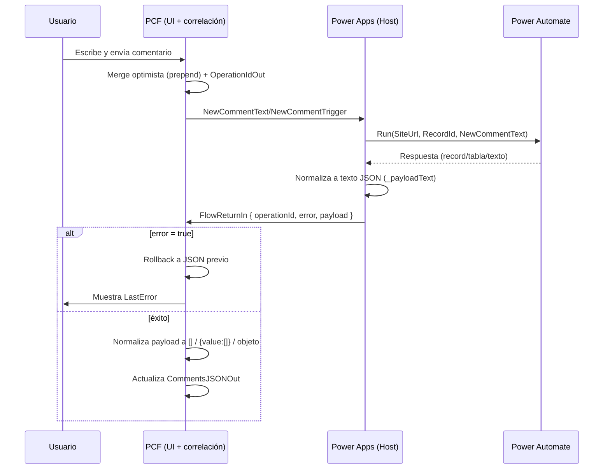

# 🚀 CommentTimeline PCF Component v2.1.2

## 📋 Descripción

**CommentTimeline** es un componente personalizado de Power Apps Component Framework (PCF) que proporciona una interfaz para mostrar comentarios de SharePoint en formato timeline. Está diseñado para integrarse con Power Apps Canvas y Power Automate (Flow).

Nota: esta copia de la documentación ha sido revisada y sanitizada para publicación pública. Se han eliminado valores de tenant y ejemplos con datos reales; configura los valores de entorno y tenant durante el despliegue en tu organización.

## ✨ Características Principales

### 🎨 **Interfaz Moderna y Profesional**
- **Diseño elegante** con tarjetas de comentarios tipo Material Design
- **Avatares de usuario inteligentes** con fotos reales de SharePoint
- **Fallback robusto** a iniciales con colores personalizados y únicos
- **Animaciones suaves** y efectos visuales profesionales
- **Responsive design** adaptativo para diferentes tamaños de PCF
- **Estados de carga** con skeleton loaders animados

### 📱 **Sistema de Avatares Avanzado**
- **Fotos reales** desde SharePoint usando `userphoto.aspx` API
- **Host del tenant configurable** para máxima compatibilidad
- **Fallback automático** a iniciales con colores únicos basados en hash del nombre
- **Dimensiones perfectas** (40x40px) sin descuadres ni distorsiones
- **Efectos hover** con escalado y sombras dinámicas
- **Transiciones suaves** entre foto e iniciales

### ⌨️ **Funcionalidades Avanzadas de UX**
- **Shortcuts de teclado** (Enter para enviar, sin Shift+Enter)
- **Contador de caracteres inteligente** con límite de 2000 caracteres
- **Sistema de advertencias** progresivo (90% del límite)
- **Auto-resize vertical** del campo de texto con límites estrictos
- **Control de expansión** para evitar desbordamiento del PCF
- **Texto completamente seleccionable** en todos los comentarios
- **Animaciones de carga** con skeleton loaders

### 🔧 **Integración Power Apps Profesional**
- **Compatibilidad total** con Power Apps Canvas
- **Propiedades de entrada/salida** optimizadas y tipadas
- **Manejo de JSON inteligente** (formato directo y `{ "value": [...] }`)
- **Parser robusto** con manejo de errores y fallbacks
- **Gestión de estado** reactiva y eficiente
- **Lifecycle management** completo del PCF

### 🏗️ **Arquitectura Técnica Sólida**
- **Patrón de capas** bien definido (Power Apps → PCF → React → CSS)
- **Componente React memoizado** para máximo rendimiento
- **Hooks personalizados** para gestión de estado
- **TypeScript estricto** con interfaces completas
- **CSS modular** con animaciones CSS3 avanzadas
- **Error boundaries** y manejo de excepciones

## 🚀 Instalación

### Prerrequisitos
- **Node.js 16+** (recomendado: 18.x LTS)
- **Power Apps CLI** (`pac`) instalado globalmente
- **Visual Studio Code** con extensiones PCF
- **Git** para control de versiones

### Pasos de Instalación

1. **Clonar el repositorio:**
```bash
# Usa la URL de tu repositorio (HTTPS o SSH). Ejemplo genérico:
git clone https://github.com/<owner>/<repo>.git
# o (SSH)
git clone git@github.com:<owner>/<repo>.git
cd Componente-PCF-Timeline-de-Comentarios
```

2. **Instalar dependencias:**
```bash
npm install
```

3. **Construir el componente:**
```bash
npm run build
```

4. **Probar localmente:**
```bash
npm start
```

5. **Verificar linting:**
```bash
npm run lint
```

## 📦 Despliegue

### Para Power Apps Canvas
```bash
# Deploy al entorno de Power Apps
# Reemplaza <your-prefix> por el publisher prefix de tu organización
pac pcf push --publisher-prefix <your-prefix>

# Con URL de entorno específica (reemplaza <env-url>)
pac pcf push --publisher-prefix <your-prefix> --env-url <env-url>
```

### Para Dataverse/Solutions
```bash
# Construir solución completa
cd Solution/PCF_SMA
dotnet build

# Importar solución al entorno (ajusta la ruta según tu plataforma)
pac solution import --path ./bin/Debug/*.zip --env-url <env-url>
```

### Para SharePoint Online
```bash
# El componente es compatible nativo con SharePoint
# Solo requiere configuración de propiedades en Power Apps
```

## ⚙️ Configuración

### Propiedades del Componente

| Propiedad | Tipo | Descripción | Requerido |
|-----------|------|-------------|-----------|
| `CommentsJSON` | Text (Multiple) | JSON de comentarios de SharePoint | No |
| `IsLoading` | Boolean (TwoOptions) | Estado de carga del componente | No |
| `NewCommentText` | Text (SingleLine.TextArea) | Texto del nuevo comentario (salida) | **Sí** |

### Configuración de Avatares

El componente puede usar la URL de tu tenant para obtener fotos de usuario. Por seguridad y para facilitar la publicación pública, NO incluimos un valor por defecto en el repositorio.

Ejemplo recomendado (usar variables de entorno o configuración en tiempo de despliegue):

```typescript
// CanvasComment/CommentTimeline.tsx
// Reemplaza '<your-tenant>' por tu tenant de SharePoint o configura mediante variables de entorno.
const SP_HOST = process.env.SP_HOST || '<your-tenant>.sharepoint.com';
```

Instrucciones:
1. Configura `SP_HOST` localmente o en tu pipeline antes de construir el paquete (no subas valores propietarios al repo).
2. Reconstruir: `npm run build`
3. Redesplegar usando `pac pcf push` con tu configuración.

### Configuración de Límites

```typescript
// Límites configurables en CommentTimeline.tsx
const MAX_CHARACTERS = 2000;        // Límite máximo
const WARNING_THRESHOLD = 1800;     // Umbral de advertencia (90%)
```

## 📊 Formato de Datos
### Contrato Simplificado para Publicación (FlowReturnIn)

La app host solo debe ejecutar el Flow cuando el PCF lo solicite (mediante `NewCommentTrigger`/`NewCommentText`) y devolver un JSON autocontenido en `FlowReturnIn` con esta forma:

```json
{
  "operationId": "<GUID>",
  "error": false,
  "payload": "<texto JSON devuelto por el Flow>"
}
```

- `operationId`: usar exactamente `OperationIdOut` emitido por el componente tras el envío.
- `error`: `true` si falló realmente el Flow; el componente hará rollback automático.
- `payload`: el resultado crudo del Flow como TEXTO JSON. Puede ser `[]`, `{}`, o `{ "value": [...] }`.

El componente se encarga de:
- UI optimista y merge seguro del comentario al inicio.
- Rollback si `error = true` o si `payload` no es utilizable.
- Normalización de `payload` a un array `[]` (array directo, objeto único o `{ value: [...] }`).

### Wiring mínimo en la app host

1) Variables (por ejemplo en `OnVisible` del Screen):

```powerfx
Set(varFlowReturn, "");
Set(varLastTrigger, -1);
```

2) Enlazar propiedades del PCF en Power Apps:

```text
CommentTimelinePCF.CommentsJSON = <tu JSON de comentarios>
CommentTimelinePCF.SiteUrl = <tu URL de sitio>
CommentTimelinePCF.RecordId = <tu ID de registro>
CommentTimelinePCF.FlowReturnIn = varFlowReturn
```

3) Ejecutar el Flow cuando hay un nuevo comentario (por ejemplo en `App.OnStart` o en un Timer que vigile el trigger):

```powerfx
If(
    CommentTimelinePCF.NewCommentTrigger > varLastTrigger,
    Set(varLastTrigger, CommentTimelinePCF.NewCommentTrigger);

    // Limpiar retorno previo
    Set(varFlowReturn, "");

    // Ejecutar Flow con manejo de errores
    Set(_hadError, false);
    Set(_resp,
        IfError(
            CrearcomentariosSMA.Run(
                CommentTimelinePCF.SiteUrl,
                CommentTimelinePCF.RecordId,
                CommentTimelinePCF.NewCommentText
            ),
            Set(_hadError, true);
            Blank()
        )
    );

    // Normalizar la carga útil del Flow a texto
    Set(_payloadText,
        If(
            _hadError || IsBlank(_resp),
            "",
            If(
                IsType(_resp, Table) || IsType(_resp, Record),
                JSON(_resp, JSONFormat.Compact),
                // Ajusta si tu Flow devuelve 'response' o 'value'
                IsBlank(_resp.response) && IsBlank(_resp.value),
                Text(_resp),
                JSON(Coalesce(_resp.response, _resp.value), JSONFormat.Compact)
            )
        )
    );

    // Entregar el paquete autocontenido al PCF
    Set(
        varFlowReturn,
        JSON(
            {
                operationId: CommentTimelinePCF.OperationIdOut,
                error: _hadError || IsBlank(_payloadText),
                payload: _payloadText
            },
            JSONFormat.Compact
        )
    )
);
```

Notas:
- El PCF comparará `operationId` internamente y hará rollback/normalización.
- No hace falta eco de versión ni más propiedades; basta con `FlowReturnIn`.
- El límite de texto es 2000 caracteres; el botón se deshabilita automáticamente si se excede.

### Diagrama del flujo optimista y rollback



## 🔁 Flujos (Power Automate)

Ver documentación completa de los Flows usados por el componente: `docs/FLOWS.md`

### JSON de Comentarios - Estructura Completa

```json
[
  {
    "id": "1",
    "text": "Contenido del comentario con soporte para 2000 caracteres",
    "author": {
      "directoryObjectId": "12345678-1234-1234-1234-123456789012",
      "email": "usuario@empresa.com",
      "expiration": "2024-12-31T23:59:59Z",
      "id": 12345,
      "isActive": true,
      "isExternal": false,
      "jobTitle": "Desarrollador Senior",
      "loginName": "i:0#.f|membership|usuario@empresa.com",
      "name": "Nombre Completo Usuario",
      "principalType": 1,
      "userId": "12345678-1234-1234-1234-123456789012",
      "userPrincipalName": "usuario@empresa.com"
    },
    "createdDate": "2024-01-15T10:30:00Z",
    "modifiedDate": "2024-01-15T11:00:00Z",
    "isReply": false,
    "parentId": "0",
    "itemId": 1,
    "listId": "list-id-unique"
  }
]
```

### Formatos Soportados

El componente maneja **automáticamente** ambos formatos:

1. **Formato directo:** `[{...}, {...}]`
2. **Formato Power Apps:** `{ "value": [{...}, {...}] }`

### Adaptación Automática de Datos

```typescript
// El componente adapta automáticamente estructuras simples:
{
  "id": "1",
  "text": "Comentario simple",
  "authorName": "Usuario",           // Se convierte a author.name
  "authorEmail": "user@email.com",  // Se convierte a author.email
  "createdDate": "2024-01-15"
}
```

## 🎯 Casos de Uso

### SharePoint Lists y Documentos
- **Comentarios en listas** de SharePoint con timeline visual
- **Seguimiento de cambios** con historial completo
- **Colaboración en tiempo real** con avatares reales
- **Comentarios en documentos** con contexto visual

### Power Apps Canvas
- **Aplicaciones de gestión** de proyectos y tareas
- **Sistemas de tickets** con comentarios organizados
- **Dashboards colaborativos** con timeline de actividades
- **Formularios de feedback** con historial visual

### Integración Empresarial
- **Comunicación interna** con avatares reales de SharePoint
- **Seguimiento de actividades** por usuario y fecha
- **Historial de cambios** visual y navegable
- **Sistemas de notificaciones** con contexto completo

## 🛠️ Desarrollo

### Estructura del Proyecto

```
CanvasGridControl/
├── CanvasComment/                   # Código fuente del componente
│   ├── CommentTimeline.tsx         # Componente principal React (722 líneas)
│   ├── index.ts                    # Punto de entrada PCF (100 líneas)
│   ├── ControlManifest.Input.xml   # Manifesto del componente
│   ├── css/                        # Estilos CSS avanzados
│   │   └── CommentTimeline.css     # CSS principal (494 líneas)
│   ├── generated/                  # Tipos generados automáticamente
│   │   └── ManifestTypes.d.ts      # Interfaces TypeScript
│   └── strings/                    # Recursos localizados
│       └── CommentTimeline.1033.resx # Recursos en inglés (99 líneas)
├── Solution/                       # Solución para Dataverse
│   └── PCF_SMA/                   # Proyecto de solución
│       ├── PCF_SMA.cdsproj        # Proyecto de solución
│       └── src/                    # Archivos de solución
├── out/                           # Build de salida
├── node_modules/                  # Dependencias
├── package.json                   # Configuración del proyecto
├── tsconfig.json                  # Configuración TypeScript
├── pcfconfig.json                 # Configuración PCF
└── README.md                      # Este archivo
```

### Comandos de Desarrollo

```bash
# Construcción
npm run build          # Construir componente
npm run rebuild        # Reconstruir desde cero
npm run clean          # Limpiar build

# Desarrollo
npm start              # Test Harness local
npm run start:watch    # Modo watch para desarrollo
npm run refreshTypes   # Actualizar tipos PCF

# Calidad de código
npm run lint           # Verificar código
npm run lint:fix       # Corregir problemas automáticamente
```

### Tecnologías Utilizadas

- **React 16.14.0** - Framework de UI
- **TypeScript 4.9.5** - Tipado estático
- **Fluent UI 8.121.3** - Componentes de Microsoft
- **PCF Scripts** - Herramientas de desarrollo PCF
- **CSS3** - Animaciones y estilos avanzados

## 📚 Documentación

### Archivos de Documentación
- **[Documentación Técnica](DOCUMENTACION-TECNICA.md)** - Detalles de implementación y arquitectura

### Características Técnicas Documentadas
- **Arquitectura de capas** completa
- **Patrones de diseño** implementados
- **Flujo de datos** detallado
- **Gestión de estado** y lifecycle
- **Optimización de rendimiento**
- **Testing y debugging**

## 🔧 Personalización

### Estilos CSS Avanzados

Los estilos están en `CanvasComment/css/CommentTimeline.css`:

- **Colores de tema** personalizables con variables CSS
- **Animaciones** configurables con keyframes
- **Responsive design** adaptable a diferentes tamaños
- **Efectos hover** y transiciones suaves
- **Skeleton loaders** personalizables

### Funcionalidades Personalizables

```typescript
// En CanvasComment/CommentTimeline.tsx
const MAX_CHARACTERS = 2000;        // Límite de caracteres
const WARNING_THRESHOLD = 1800;     // Umbral de advertencia

// Colores de avatares
const colors = ['#0078d4', '#106ebe', '#005a9e', '#004578', '#003366'];

// Formato de fechas
const formatDate = (dateString: string) => {
    // Lógica personalizable de formato
};
```

### Temas y Colores

```css
/* Variables CSS personalizables */
:root {
    --primary-color: #0078d4;
    --secondary-color: #106ebe;
    --background-color: #fafbfc;
    --border-color: #e1e5e9;
    --text-primary: #323130;
    --text-secondary: #605e5c;
}
```

## 🐛 Solución de Problemas

### Avatares no se muestran
1. **Verificar SP_HOST:** Confirmar que el host del tenant sea correcto
2. **Permisos SharePoint:** Verificar permisos de lectura de fotos de perfil
3. **Emails válidos:** Confirmar que los emails en el JSON sean correctos
4. **Fallback automático:** El componente mostrará iniciales si no hay foto

### JSON no se procesa
1. **Formato válido:** Verificar que el JSON sea sintácticamente correcto
2. **Estructura:** Comprobar que tenga la estructura esperada
3. **Consola:** Revisar logs del navegador para errores específicos
4. **Parser robusto:** El componente maneja automáticamente diferentes formatos

### Componente no carga
1. **Dependencias:** Ejecutar `npm install` para instalar dependencias
2. **Build:** Ejecutar `npm run build` para construir el componente
3. **Test Harness:** Verificar que funcione con `npm start`
4. **Logs:** Revisar consola del navegador para errores

### Rendimiento lento
1. **Memoización:** El componente ya está optimizado con React.memo
2. **Virtualización:** Para listas muy largas, considerar implementar virtualización
3. **Imágenes:** Las fotos de perfil se cargan de forma lazy
4. **CSS:** Las animaciones usan transform y opacity para máximo rendimiento


## 👨‍💻 Autor

**Yoany Bermudez**
- **Desarrollador Senior** especializado en Power Platform
- **Arquitecto de soluciones** empresariales
- **GitHub:** [kemador1](https://github.com/kemador1)
- **Especialización:** SharePoint, Power Apps, Dataverse

## 🤝 Contribuciones

Las contribuciones son **muy bienvenidas**. Por favor:

1. **Fork** el proyecto
2. **Crear** una rama para tu feature (`git checkout -b feature/AmazingFeature`)
3. **Commit** tus cambios (`git commit -m 'Add some AmazingFeature'`)
4. **Push** a la rama (`git push origin feature/AmazingFeature`)
5. **Abrir** un Pull Request

### Guías de Contribución
- **Código limpio** y bien documentado
- **Tests** para nuevas funcionalidades
- **Documentación** actualizada
- **Estilo consistente** con el proyecto existente

## 📞 Soporte

### Canales de Soporte
- **Issues:** [[GitHub Issues](https://github.com/kemador1/CommentTimeline-PCF/issues](https://github.com/kemador1/Componente-PCF-Timeline-de-Comentarios/issues))
- **Documentación:** Ver archivos `.md` en el repositorio

## 🚀 Roadmap

### Versiones Futuras
- **v2.2.0:** Soporte para respuestas anidadas (threading)
- **v2.3.0:** Integración con Microsoft Graph API
- **v2.4.0:** Temas personalizables y modo oscuro
- **v3.0.0:** Soporte para Power Apps Model-Driven Apps

### Mejoras Planificadas
- **Drag & Drop** para reordenar comentarios
- **Búsqueda** y filtrado avanzado
- **Exportación** a PDF/Excel
- **Notificaciones** push en tiempo real

---

**Versión:** 2.1.2  
**Última actualización:** Octubre 2025 
**Compatibilidad:** Power Apps Canvas, SharePoint Online  
**Estado:** Production Ready - Enterprise Grade  
**Mantenimiento:** Activo con soporte completo
